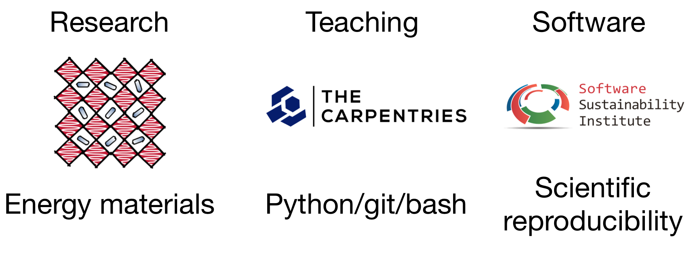
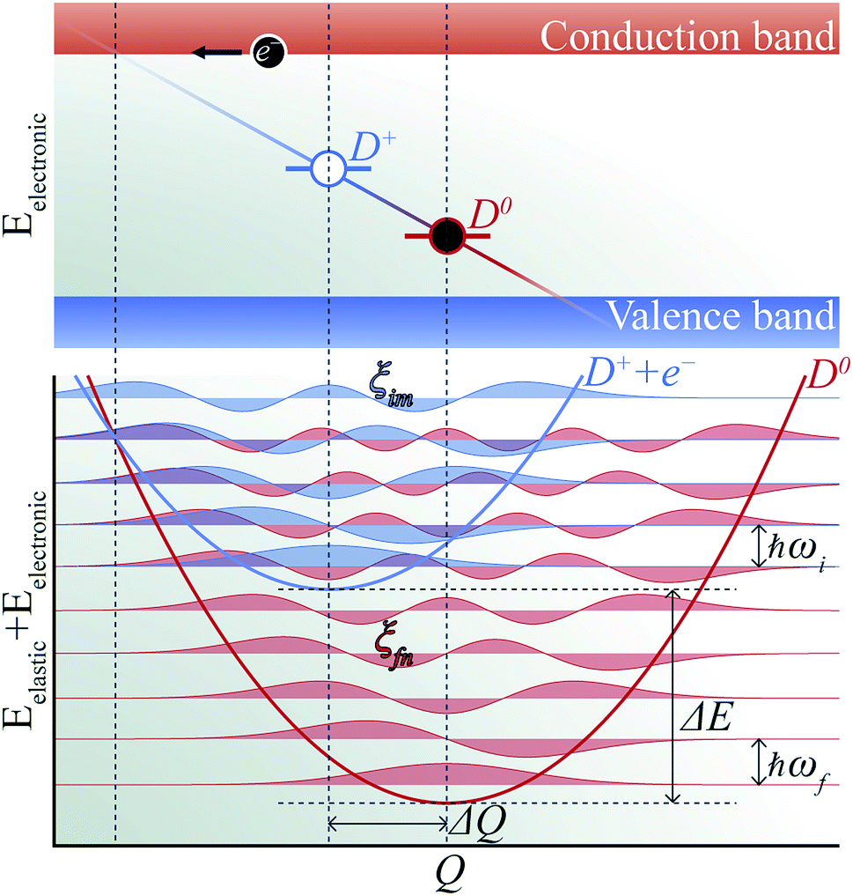

<!-- .slide: data-background="./background.png" -->

### Carrier capture via multiphonon emission

Lucy Whalley | Research Assistant  
Materials Design Group | ICL
 
[lucydot.github.io/slides](https://lucydot.github.io/slides)
 
 

<!--s-->

<!-- .slide: data-background="./background2.png" -->

#### About Me

<!--s-->

<!-- .slide: data-background="./background2.png" -->

#### My interests

<!--s-->

<!-- .slide: data-background="./background2.png" -->

#### Materials Design Group

 
 
 
 
 

<!--s-->

<!-- .slide: data-background="./background2.png" -->

#### Materials Design Group

 
 
Design and optimisation of energy materials using electronic structure theory, multi-scale methods and data-driven approaches

<!--s-->

<!-- .slide: data-background="./background2.png" -->

#### PhD research

<small>
[Phys. Rev. B 99 (8), 085207](https://dx.doi.org/10.1103/PhysRevB.99.085207)  |  [ACS Energy Lett. 2 (12) 2713](https://dx.doi.org/10.1021/acsenergylett.7b00862)  |  [ACS Energy Lett. 2 (12) 2647](https://dx.doi.org/10.1021/acsenergylett.7b00995)

<!--s-->

<!-- .slide: data-background="./images/background2.png" -->

#### Hybrid halide perovskites 

<video autoplay="true" loop="true" muted="true" width="800" align="center">
    <source src="MAPI_animation.mp4" type="video/mp4" />
</video>

<small>
*Perspective: Theory and simulation of hybrid halide perovskites*  
[J. Chem. Phys 146, 220901](https://aip.scitation.org/doi/10.1063/1.4984964)
</small>

<!--s-->

<!-- .slide: data-background="./background2.png" -->

#### Carrier Capture at point defects

1. Motivation: **killer** defects 

2. Carrier capture via multiphonon emission

3. `carriercapture.jl`: outline and case study

4. Normal phonon modes of defect systems

<!--s-->

<!-- .slide: data-background="./background2.png" -->

#### Non-radiative processes

<small>
* Electronic energy --> carrier kinetic energy (Auger, high carrier densities)
* Electronic energy --> vibrational energy (trap-assisted, low carrier densities)
* Consequences for devices: e.g. V$_\textrm{oc}$ deficit in CZTS is attributed to short carrier lifetime ([reference](https://pubs.acs.org/doi/10.1021/acsaem.8b00194)).

From [PhD thesis of Nico Tucher](http://publica.fraunhofer.de/eprints/urn_nbn_de_0011-n-4524396.pdf)

</small>

<!--s-->

<!-- .slide: data-background="./background2.png" -->

#### Killer defects

<small>
> "Killer centres, those imperfections which cause rapid recombination even at low concentrations."

--Marshall Stoneham, [*Non-radiative transitions in semiconductors*](https://iopscience.iop.org/article/10.1088/0034-4885/44/12/001)
* Defects with fast non-radiative transitions
* There are two types of killer defects
	* shallow defects with hydrogenic-like excited states 
	* deep defects where multiple phonons are released during carrier capture

</small>

<!--s-->

<!-- .slide: data-background="./background2.png" -->

#### Configuration coordinate diagram
<small>

From MSci thesis of [Puck van Gerwen](https://uk.linkedin.com/in/puck-van-gerwen-9988509a)
* Carrier capture into a localised electronic states
* Accompanied by a lattice distortion which can be represented by a single effective coordinate $Q$.
* Configuration Coordainte diagrams plot $E$ against $Q$ and describe how the atoms in a lattice rearrange themselves when the charge state of the defect changes.

</small>

<!--s-->

<!-- .slide: data-background="./background2.png" -->

#### Configuration coordinate diagram
<small>

*Lone-pair effect on carrier capture in Cu$_2$ZnSnS$_4$ solar cells*  
Sunghyun Kim et al. [J. Mater. Chem. A (7) 2686](http://dx.doi.org/10.1039/C8TA10130B)

</small>

Note: The initial excited state of system, for example, a positively charged donor (D+) with an electron in the conduction band (e−), vibrates around the equilibrium geometry. Owing to the electron–phonon coupling, the deformation of the structure causes the electronic energy level of a state localized around the defect to oscillate. As the defect level approaches the conduction band, the probability for the defect to capture an electron increases significantly. When an electron is captured, the donor becomes neutral (D0) and relaxes to a new equilibrium geometry by emitting multiple phonons as shown in Fig. 2. To describe and predict this process, quantitative accounts of the electronic and atomic structures as well as the vibrational properties of the defect are essential.

<!--s-->

<!-- .slide: data-background="./background2.png" -->

#### Alkauskas' methodology

<small>
* Calculate the capture coefficient $C$ within a certain set of approximations:
	* one-dimensional configuration coordinate $Q$ 
	* static coupling theory for electron-phonon matrix elements $W_\textrm{if}$
* Methodology introduced by [Audrius Alkaskas](https://scholar.google.com/citations?user=R9rJJwUAAAAJ&hl=en)
* Benchmarked using hole-capturing centres in GaN and ZnO

</small>

<!--s-->

<!-- .slide: data-background="./background2.png" -->

#### Promoting and Accepting modes
<small>

From Stoneham *["Non-radiative transitions in semiconductors"](https://pdfs.semanticscholar.org/0a30/ebcb3c77c99d4f8c835afc5b6611264e06c8.pdf)*
* Lattice vibrations enter in two ways:
	- *Accepting modes*: the modes which take up the electronic energy and ensure energy conservation. 
	- *Promoting modes*: the modes which affect the electron-phonon matrix elements
* The configuration coordinate $Q$ refers to the accepting modes
* We can verify *a-posteriori* that $Q$ has strong promoting character (that electron-phonon coupling is significant for this distortion)

</small>

<!--s-->

<!-- .slide: data-background="./background2.png" -->

#### `carriercapture.jl`

<small>
* Implemented in [carriercapture.jl](https://github.com/WMD-group/CarrierCapture.jl) by Sunghyun Kim (main developer), Sam Hood, Puck van Gerwen and myself
* Includes an extension to **anharmonic energy surfaces** 
* We are currently in the process of preparing this for submission to the [Journal of Open Source Software](https://joss.theoj.org/)

</small>

<!--s-->

<!-- .slide: data-background="./background2.png" -->

#### `carriercapture.jl`

<small>
Calculation procedure:

1. Generate 1D configuration coordinate diagram  
*Calculate equilibrium geometries and total energies of defect supercells in initial and final charge states, then calculate the total energy at interpolated and extrapolated structures*

2. Calculate the phonon overlap  
*Solve the 1D Schrodinger equation for each potential energy surface (PES) to obtain the phonon wavefunctions and calculate the wavefunction overlap between each PES*

3. Calculate the electron-phonon coupling matrix element  
*Calculate the band-edge and defect single particle electron wavefunctions at interpolated structures and calculate the change in wavefunction overlap as a function of $Q$.*

</small>

<!--s-->

<!-- .slide: data-background="./background2.png" -->

#### H-centre in MAPI - charge localisation

 
<small>

*H-Center and V-Center Defects in Hybrid Halide Perovskites*    
L. D. Whalley et al. | ACS Energy Lett. (2017) | [doi:10.1021/acsenergylett.7b00995](https://doi.org/10.1021/acsenergylett.7b00995)

</small>

Note: Mao Hua Du: "..among native point defects..only the iodine interstitial and its complexes induce deep electron and hole trapping"

<!--s-->

<!-- .slide: data-background="./background2.png" -->

#### H-centre in MAPI - C.C. diagram

<small>

* After photo excitation there is electron capture at the H-centre 
* After electron capture there is a large lattice distortion; radiative recombination is suppressed.
* There is a large energetic barrier to hole capture

</small>

Note: the very large lattice distortion. The process will be non-radiative as the minimum of the negative charge state lies outside of the PES of the neutral charge.

<!--s-->

<!-- .slide: data-background="./background2.png" -->

#### H-centre in MAPI - C.C. diagram

<small>

<!--s-->

<!-- .slide: data-background="./background2.png" -->

#### H-centre in MAPI - anharmonicity 

<small>

Anharmonic effects are important in MAPI: the harmonic approximation underestimates the carrier capture coefficient at room temperature by eight orders of magnitude 

</small>

Note: the intercept is now at about 0.5eV above the energy minima at equilibrium 

<!--s-->

<!-- .slide: data-background="./background2.png" -->

#### H-centre in MAPI - eigenvalues

<small>

* The neutral charge state has a deep defect level for carrier capture
* The electron phonon matrix element is 0.0036 eV amu$^{-0.5}$A$^{-1}$
* Electron-phonon coupling in the strong coupling limit can be estimated using: $W_{if}\approx \frac{\Delta E}{\Delta Q}\sqrt{\frac{N_d}{N_b}}$ 
* For this system $W_{if}\approx 0.0048$, suggesting that electron-phonon coupling for the collective mode $Q$ is strong --> the 1D configuration coordinate approach is valid.

</small>

<!--s-->

<!-- .slide: data-background="./background2.png" -->

#### H-centre in MAPI - capture coefficient

<small>

At room temperature the carrier capture coefficient is $1.2\times10^{-10}$cm$^3$s$^{-1}$
(compare this to the rate given for fast radiative carrier capture $\sim1.2\times10^{-13}$cm$^3$s$^{-1}$)

</small>

<!--s-->

<!-- .slide: data-background="./background2.png" -->

#### Note on calculating carrier capture rate

<small>

* For electron capture at a neutral defect, the carrier capture rate $R$ is given by $R = C_eN_t$ where $C_e$ is the electron capture coefficient and $N_t$ is the density of neutral traps.
* In this study I did not calculate the trap density, but assuming a trap density of $1\times10^{16}$cm$^{-3}$ ([reference](https://www.nature.com/articles/nmat3911?platform=oscar&draft=collection)) gives a rate constant of $1.2\times10^{6}$cm$^3$s$^{-1}$, compared to an experimental rate constant of $2\times10^{7}$cm$^3$s$^{-1}$ ([reference](https://onlinelibrary.wiley.com/doi/full/10.1002/adfm.201502340)).
* For capture at a charged defect the coulombic attraction/repulsion must be accounted for. An effective mass approximation, the Sommerfield factor, can be used which requires the **effective mass** and **low-frequency dielectric constant**.

</small>

<!--s-->

<!-- .slide: data-background="./background2.png" -->

#### Normal phonon modes 
#### of a defect system

<small>

The normal phonon modes of a crystal containing a defect can be divided into three kinds: lattice modes (optic and acoustic branches), resonant modes, and local modes.

</small>

Note: The lattice modes are largely unaffected by the defect and are well approximated by the the normal modes of the pristine crystal. They have the same amplitude throughout the crystal, except near the defect where there may be some slight modification. Resonant modes have frequencies that lie within the continuum of lattice modes. Atomic motion is strongly enhanced near the defect and diminishes away from the defect. Finally, local modes have frequencies that lie outside those of the pristine lattice modes. Here the motion is local and dies away to zero far from the defect.

<!--s-->

<!-- .slide: data-background="./background2.png" -->

#### Normal phonon modes of the 
#### iodine interstital 

<small>

When an iodine interstitial is introduced the translational symmetry of the crystal is broken and the energetically degenerate modes of the pristine crystal become non-degenerate and increasingly localised.

</small>

<!--s-->

<!-- .slide: data-background="./background2.png" -->

#### IPR of the iodine interstitial

<small>

* IPR = Inverse Participation Ratio   
* The phonon mode with the largest contribution from the iodine dimer is a localised mode with an IPR = 21.4 and a frequency of 1.59 THz
* This frequency is equal to the frequency of the negative interstitial PES (harmonic) --> a normal phonon mode with strong accepting character

</small>

<!--s-->

<!-- .slide: data-background="./background2.png" -->

#### Summary

<small>
* Total energies and single particle energies / wavefunctions from a DFT calculation can be used to calculate the rate of carrier capture at a defect from first principles
* A localised eigenstate in the band gap of the material is needed for carrier capture
* The calculation is simplified by considering only a single collective phonon mode
* In the hybrid halide perovskites anharmonicity should be considered
* Electron capture at the neutral H-centre defect is fast 

</small>

<!--s-->

#### Thanks
<!-- .slide: data-background="./background2.png" -->

Presentation slides: [lucydot.github.io/slides](https://lucydot.github.io/slides/)  
Presentation made using [reveal-md](https://github.com/webpro/reveal-md)

<!--v-->

<!-- .slide: data-background="./background2.png" -->

<!--v-->

<!-- .slide: data-background="./background2.png" -->

#### Low carrier concentration

<!--v-->

<!-- .slide: data-background="./background2.png" -->

#### High carrier concentration

<!--v-->

<!-- .slide: data-background="./background2.png" -->

#### The alpha parameter ($eV^{-1}$)
<small>

| Material       | band         | [100] | [110]| [111]
| ------------- |-------------| -----|-----|-----|
| MAPI      | hole | 4.27 | 1.88| 1.32|
|      | electron      |  2.21 | 1.35| 0.16|
| CdTe | hole      |    1.25| 1.49| 1.64|
|  | electron     |    0.72 | 0.94| 1.02 |

 

*effmass: An effective mass package*   
L. D. Whalley | JOSS (2018) | [doi:10.21105/joss.00797](https://doi.org/10.21105/joss.00797)
</small>

<!--v-->
<!-- .slide: data-background="./background2.png" -->

#### MAPI optical effective mass
<small>

*Impact of non-parabolic electronic band structure on the properties of PV materials*   
L. D. Whalley et al. | PRB (2019) | [doi:10.1103/PhysRevB.99.085207](https://doi.org/10.1103/PhysRevB.99.085207)

</small>
<!--v-->

<!-- .slide: data-background="./background2.png" -->

#### MAPI polaron mobility
<small>

Polaron mobility code available at [github.com/jarvist/PolaronMobility.jl](https://github.com/jarvist/PolaronMobility.jl)

</small>

<!--v-->
<!-- .slide: data-background="./background2.png" -->

#### MAPI band gap broadening
<small>	

*Phonon anharmonicity, lifetimes, and thermal transport in CH$_3$NH$_3$PbI$_3$ from many-body perturbation theory*  
L. D. Whalley et al. | Phys. Rev. B (2017) | [doi:10.1103/PhysRevB.94.220301](https://doi.org/10.1103/PhysRevB.94.220301)

</small>

<!--v-->
<!-- .slide: data-background="./background2.png" -->

#### Calculation details

