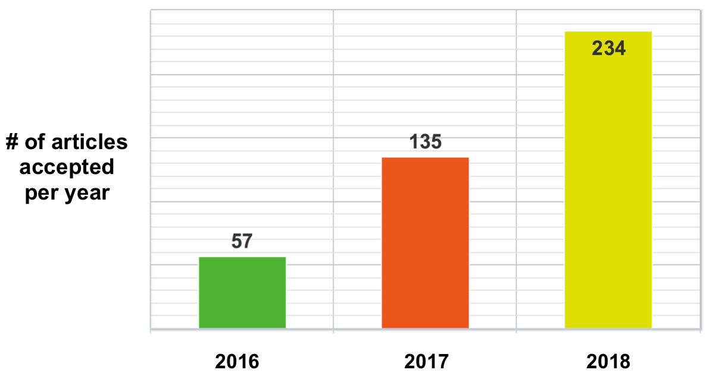

### Publishing your Software Project 
#### with the Journal of Open Source Software

Lucy Whalley  
[lucydot.github.io/slides](https://lucydot.github.io/slides)

<!--s-->

#### Materials Design Group @ ICL

[github.com/WMD-group](https://github.com/WMD-group)

<!--s-->

#### `effmass` Python package

code: [github.com/lucydot/effmass](https://github.com/lucydot/effmass)  
research paper: [arxiv.org/abs/1811.02281](https://arxiv.org/abs/1811.02281)

<!--s-->

#### From the [JOSS guiding principles](https://joss.readthedocs.io/en/latest/reviewer_guidelines.html#guiding-principles)
 
> "We like to think of JOSS as a ‘developer friendly’ journal. That is, if the submitting authors have followed best practices (have documentation, tests, continuous integration, and a license) then their review should be rapid."

 
 
<!--s-->

#### Why should I submit to JOSS?

  

- published paper and citations
- an incentive to learn new tools
- peer review process brings increased confidence
- good way to promote your code to the community

<!--s-->

#### Why should *we* submit to JOSS?

- well-documented and well-tested software freely available to the research community
- reproducibility, sustainability, maintainability
- article: ["The Scientific Paper Is Obsolete"](https://www.theatlantic.com/science/archive/2018/04/the-scientific-paper-is-obsolete/556676/)

<!--s-->

#### JOSS is growing

<!--s-->

#### The JOSS [submission and review flow](https://peerj.com/articles/cs-147/)

<!--s-->

#### A JOSS paper contains...

- A list of the authors of the software and their affiliations
- A summary describing the high-level functionality
- A clear statement of need 
- A list of key references 
- Mentions any ongoing research projects using the software

#### ...not a lot!

<!--s-->

#### The JOSS review criteria

- Software license
- Functionality
- Installation instructions
- Community guidelines
- **Tests**
- **Documentation**

<!--s-->

#### Tests 

<!--s-->

#### Documentation

tutorials / explanation / reference
Jupyter / research paper or RTD / RTD

<!--s-->

#### Final thoughts

- Other relevant journals: [www.codeisscience.com](http://www.codeisscience.com/journal_table.html)
- JOSS are always looking for new reviewers
- Possible ways to support each other? --> workshops, code review, mentoring.

slides and image credits at [lucydot.github.io/slides](lucydot.github.io/slides)

