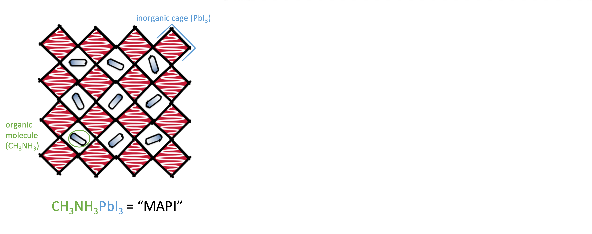
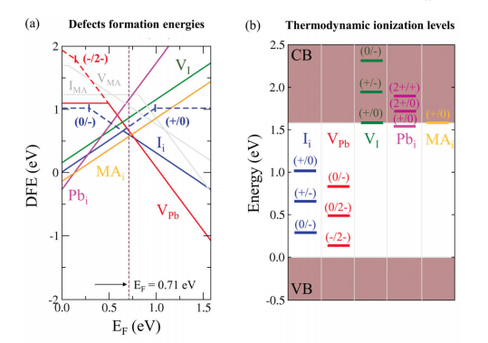
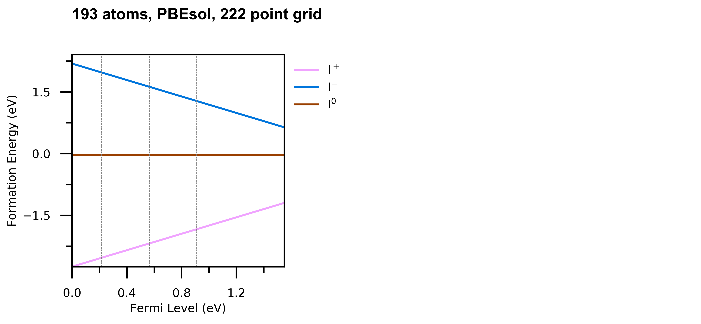
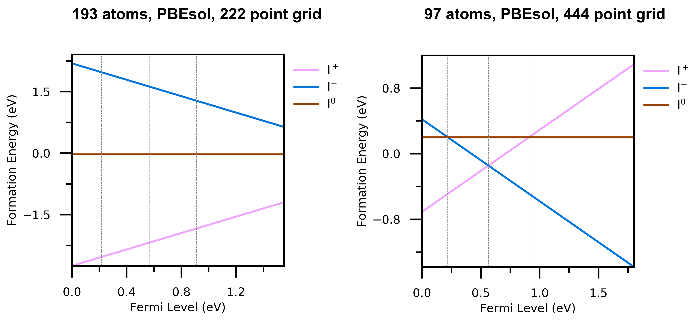
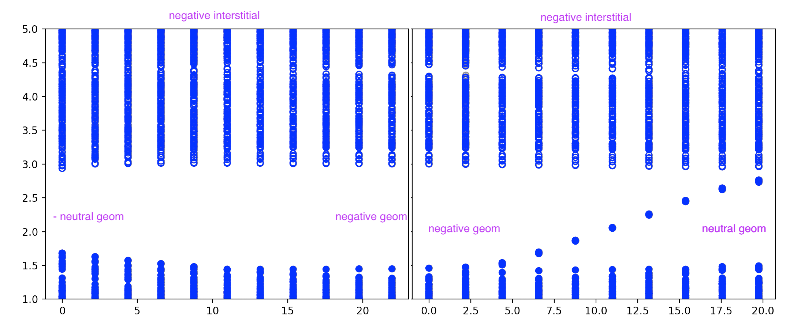
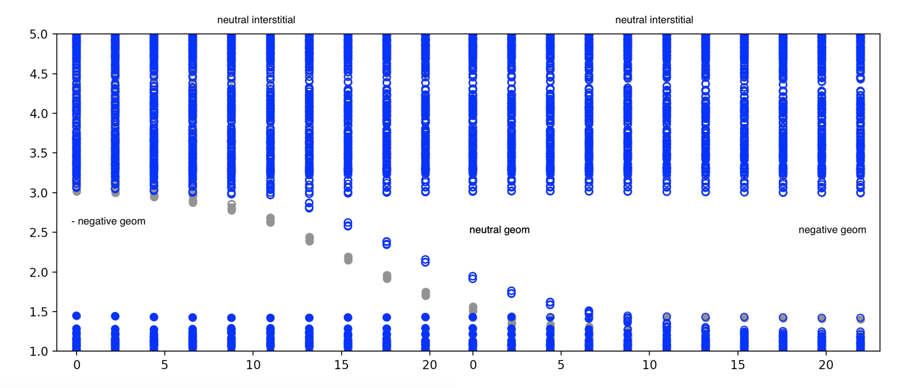
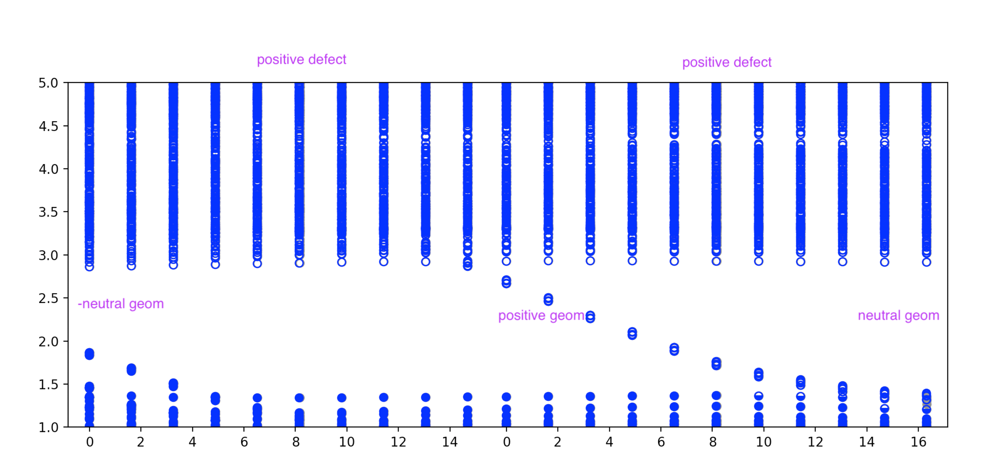
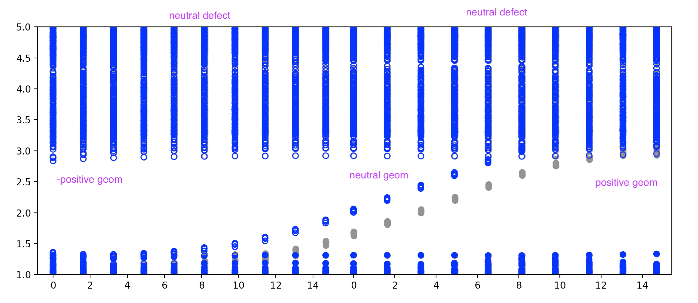
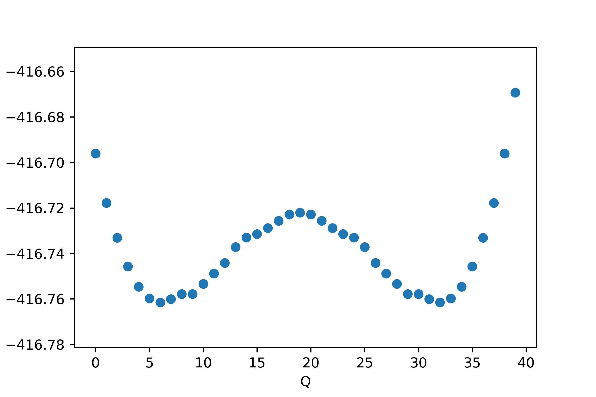

<section data-background="images/polkadot_side.svg">
### Group Meeting

#### Lucy Whalley

#### March 2019

<!--s-->

#### Hybrid halide perovskite (HHP)

<section data-background="images/polkadot_side.svg">

<!--s-->

#### Hybrid halide perovskite (HHP)

<section data-background="images/polkadot_side.svg">

<!--s-->

#### Point defects in HHP's

<section style="text-align: left;" data-background="images/polkadot_side.svg">

<small>

##### Defect Tolerance

- low temperature synthesis (cf: Czochralski process at $1500\,^{\circ}{\rm C}$)  
- experimental measurements: $10^{15}-10^{17}$cm$^{-3}$ (eg: [Heo et al.](https://doi.org/10.1002/adma.201500048))
- DFT calculations: $10^{17}-10^{20}$cm$^{-3}$ (eg: [Walsh et al.](https://doi.org/10.1002/anie.201409740)) 

vs

- long diffusions lengths ($>1\mu m$, [Stranks et al.](https://doi.org/10.1126/science.1243982))
- high efficiencies with limited defect engineering  
 

##### Defect mobility

- point defects associated with the halide sub lattice are mobile ([Senocrate et al.](https://doi.org/10.1002/anie.201701724))

</small>

<!--s-->

#### Charge transition diagram

<section data-background="images/polkadot_side.svg">

[Meggiolaro et al.](https://doi.org/10.1039/C8EE00124C)

<!--s-->
#### Charge transition diagram

<section data-background="images/polkadot_side.svg">

[M.-H. Du](https://doi.org/10.1021/acs.jpclett.5b00199)

<!--s-->

#### Configuration Coordinate Diagram

<section data-background="images/polkadot_side.svg">

(of a sort) - [Meggiolaro et al.](https://doi.org/10.1039/C8EE00124C)

<!--s-->

#### Configuration Coordinate Diagram

<section data-background="images/polkadot_side.svg">

(of a sort) - [Meggiolaro et al.](https://doi.org/10.1039/C8EE00124C)

<!--s-->

#### Perfect bulk structure

<section data-background="images/polkadot_side.svg">

<small>

- 192 atom supercell
- built from $\sqrt2\times\sqrt2\times2$ 12-atom cubic cell using transformation matrix $m_t$:
$$ 
m_t = 
\begin{bmatrix}
    2      & -2 & 0\\\
    2      & 2 & 0\\\
    0       & 0 & 2\\\
\end{bmatrix}
$$
- phonon dispersion is sensible

</small>

<!--s-->
#### Defect geometries

<section data-background="images/polkadot_side.svg">

<!--s-->

#### Displacement vectors

<section data-background="images/polkadot_side.svg">

[github.com/lucydot/vesta_vectors](https://github.com/lucydot/vesta_vectors)

<small>All atomic displacement >0.3 $\mathring A$, moving between neutral and negative charge state</small>

<!--s-->
#### Charge transition level diagram

<section data-background="images/polkadot_side.svg">

<!--s-->

#### Charge transition level diagram

<section data-background="images/polkadot_side.svg">

<!--s-->
<section data-background="images/polkadot_side.svg">
#### Negative Potential Energy Surface (PES) : ionic relaxation

[github.com/lucydot/scripts/vaspscripts/extract_EQ.py](https://github.com/lucydot/scripts/vaspscripts/extract_EQ.py)
<!--s-->

#### Negative & Neutral PES: linear interpolation

<section data-background="images/polkadot_side.svg">

At $E_F = 0.7\,\textrm{eV}$ above the VBM

<!--s-->

#### Positive & Neutral PES: linear interpolation

<section data-background="images/polkadot_side.svg">

At $E_F = 0.7\,\textrm{eV}$ above the VBM

<!--s-->

#### Positive & Neutral PES: linear interpolation
<section data-background="images/polkadot_side.svg">

At $E_F = 0.7\,\textrm{eV}$ above the VBM
<!--s-->

#### Calculating electron-phonon coupling 
<section data-background="images/polkadot_side.svg">

[Alkauskas et al.](https://doi.org/10.1103/PhysRevB.90.075202)  
[github.com/WMD-group/CarrierCapture.jl](https://github.com/WMD-group/CarrierCapture.jl)

<!--s-->

##### Electronic structure
<section data-background="images/polkadot_side.svg">

<!--s-->

##### Electronic structure
<section data-background="images/polkadot_side.svg">

<!--s-->

##### Electronic structure
<section data-background="images/polkadot_side.svg">

<!--s-->

##### Electronic structure
<section data-background="images/polkadot_side.svg">

<!--s-->

#### Next steps
<section data-background="images/polkadot_side.svg">
<small>

- Calculate the wavefunction overlap at PBEsol level of theory
- Total energies using the HSE06 functional + SoC (needed for accurate defect energy levels)
- Wavefunctions of distorted structures using the HSE06 functional + SoC
- Defect corrections using Sxdefectalign
- Perfect bulk energy from modemapping?

</small>

