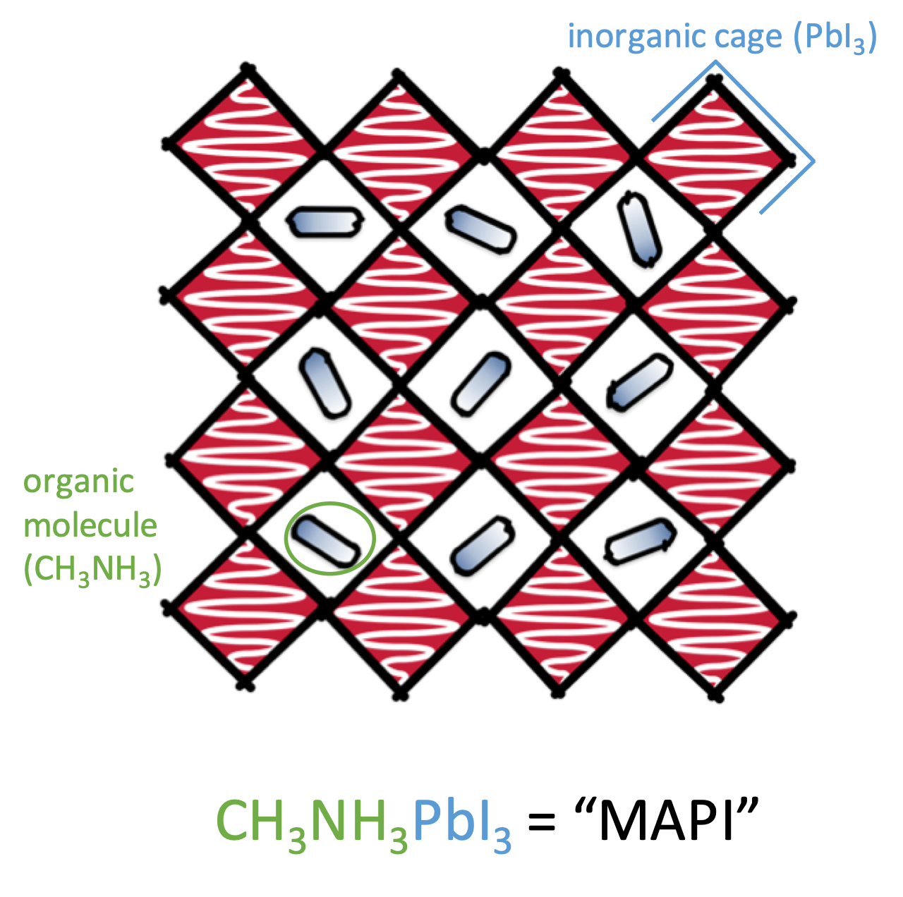
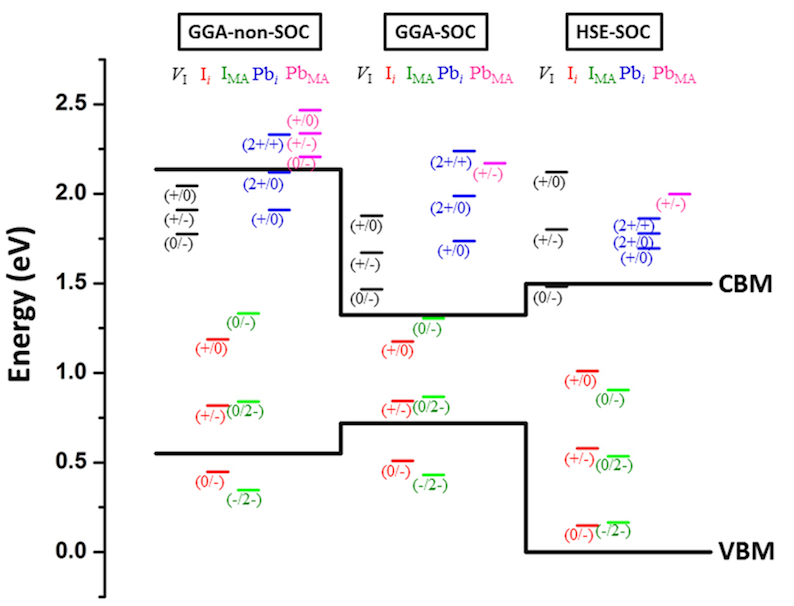
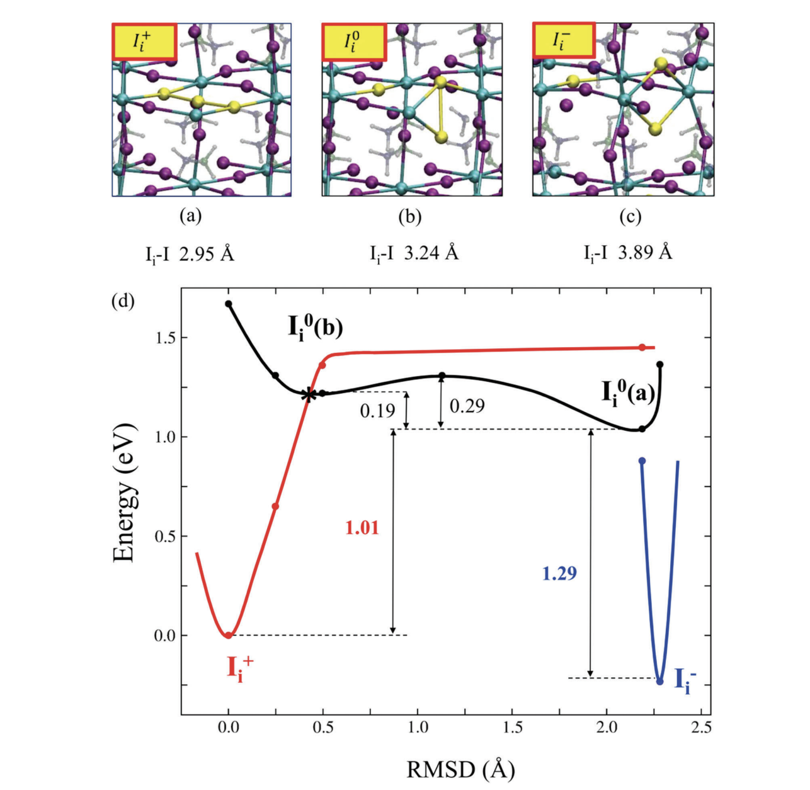
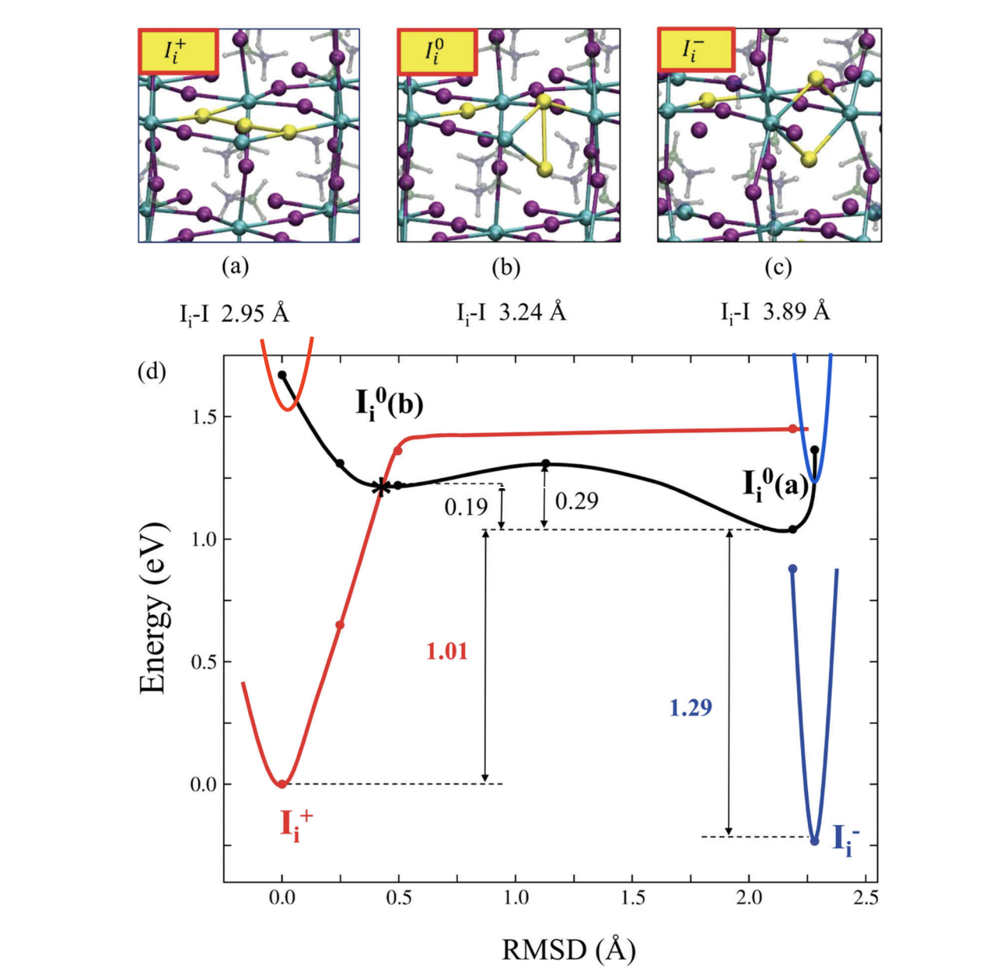
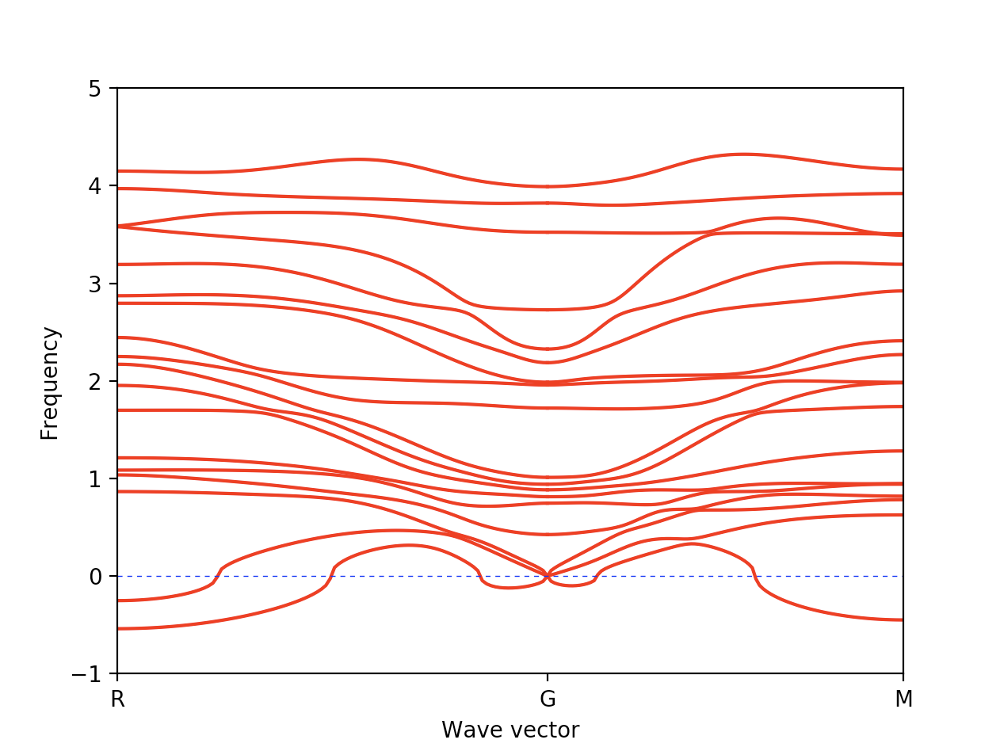
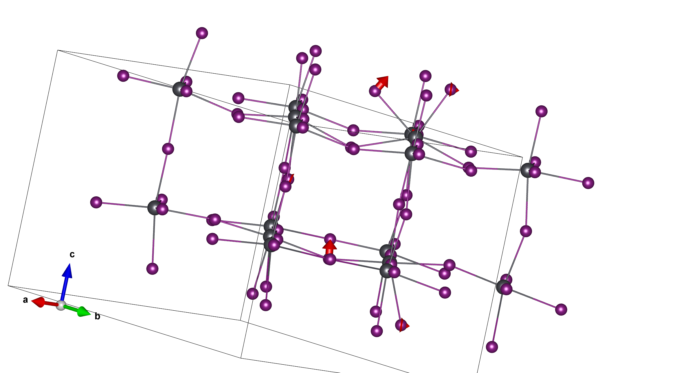
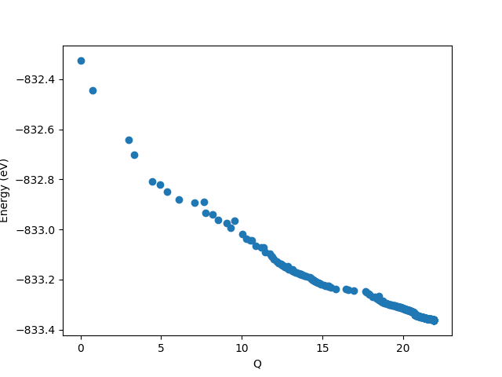
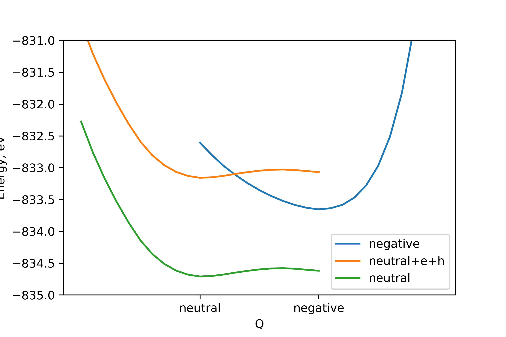
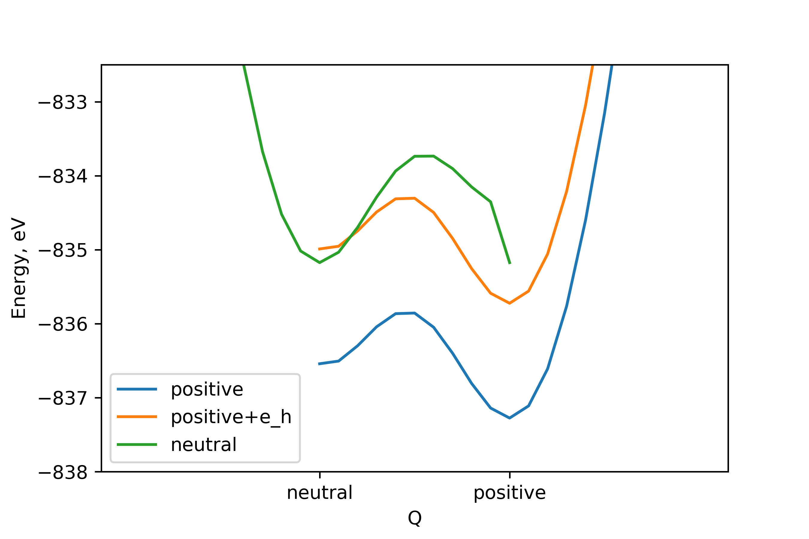
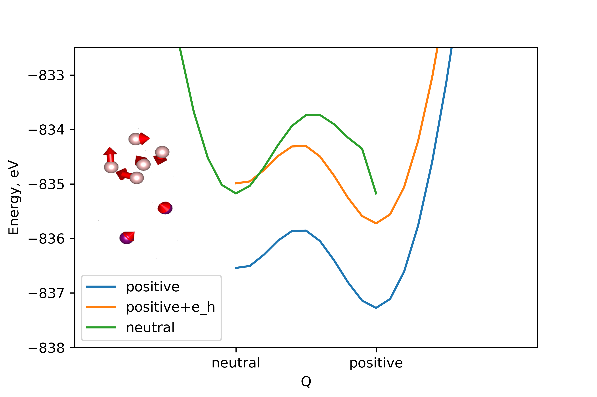

<section data-background="images/polkadot_side.svg">
### Group Meeting

#### Lucy Whalley

#### March 2019

<!--s-->

#### Hybrid halide perovskite (HHP)

<!--s-->

#### Point defects in HHP's

<small>

- low temperature synthesis   
--> many point defects
- low formation energies   
--> many point defect
- high efficiencies with limited defect engineering  
---> defect tolerance
- point defects associated with the halide sub lattice are mobile ([Senocrate et al.](https://doi.org/10.1002/anie.201701724))

</small>

<!--s-->

#### Charge transition diagram

[M.-H. Du](https://doi.org/10.1021/acs.jpclett.5b00199)

<!--s-->

#### Configuration Coordinate Diagram

(of a sort)

[Meggialaro et al.](https://doi.org/10.1039/C8EE00124C)

<!--s-->

#### Configuration Coordinate Diagram

(of a sort)

<!--s-->

#### Perfect bulk structure

<small>

- 192 atom supercell
- built from $\sqrt2\times\sqrt2\times2$ 12-atom cubic cell using transformation matrix $m_t$:
$$ 
m_t = 
\begin{bmatrix}
    2      & -2 & 0\\\
    2      & 2 & 0\\\
    0       & 0 & 2\\\
\end{bmatrix}
$$
- phonon dispersion is sensible

</small>

<!--s-->
#### Defect geometries

<!--s-->

#### Displacement vectors

[github.com/lucydot/vesta_vectors](https://github.com/lucydot/vesta_vectors)

<small>all atomic displacement >0.3 $\mathring A$, moving between neutral and negative charge state</small>

<!--s-->
#### Charge transition level diagram

<!--s-->
#### Negative Potential Energy Surface (PES) : ionic relaxation

[github.com/lucydot/scripts/vaspscripts/extract_EQ.py](https://github.com/lucydot/scripts/vaspscripts/extract_EQ.py)

<!--s-->

#### Negative & Neutral PES: linear interpolation

<!--s-->

#### Positive & Neutral PES: linear interpolation

<!--s-->

#### Positive & Neutral PES: linear interpolation

<!--s-->

#### Calculating electron-phonon coupling 

[github.com/WMD-group/CarrierCapture.jl](https://github.com/WMD-group/CarrierCapture.jl)

<!--s-->

#### Electronic levels of defect

<!--s-->

#### Defect phonons

<!--s-->

#### Future work
<small>

- Waiting for total energies using the HSE06 functional + SoC (needed for accurate defect energy levels)
- Perfect bulk energy from modemapping

</small>

