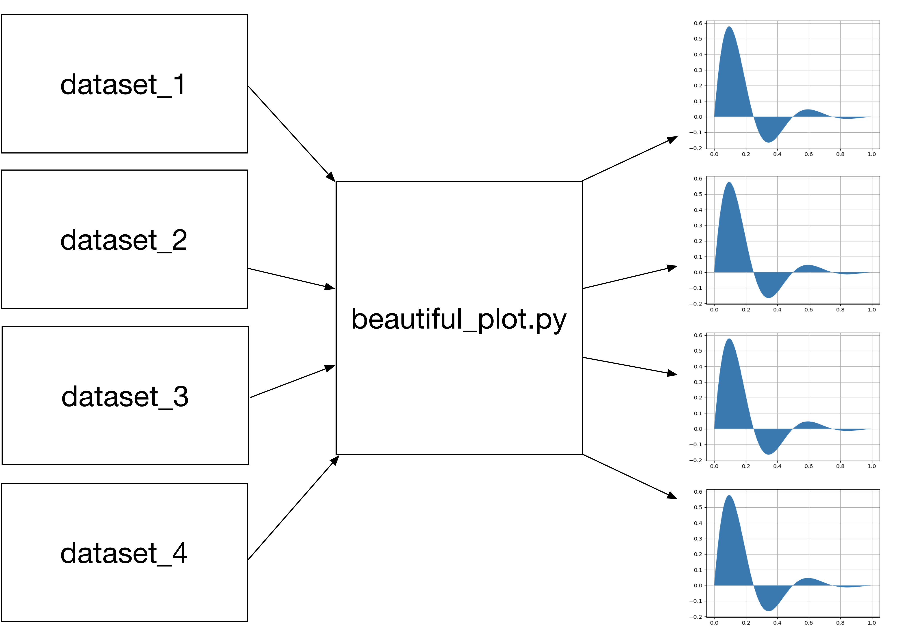

## Welcome

### Programming with Python

</br>

Lucy Whalley / l.whalley@northumbria.ac.uk. 
[lucydot.github.io/slides](https://lucydot.github.io/slides)
[lucydot.github.io/python_novice](https://lucydot.github.io/python_novice)

<!--s-->

### Hi! I'm Lucy

- University of Birmingham: MSci Theoretical Physics
- Birmingham City University: PGCE Mathematics
- Imperial College London: PhD in Materials Science (with the CDT-PV)
- Imperial College London: Research Associate in Solar Cells
- University of Northumbria: Vice-Chancellor's Fellow

<!--s-->

### Hi! I'm Lucy

- University of Birmingham: C++ / Python
- Birmingham City University: HTML / static websites
- Imperial College London: High-performance computing / Software Carpentry / Fellow @ Software Sustainability Institute 
- University of Northumbria: ???

<!--s-->

### Workshop outline

- Day One: Python basics (variables, data types, for loops, conditionals, functions)
- Day Two: Data analysis and plotting

...but why is this important?

<!--s-->


<!--s-->

### Why Programming? Reproducibility

> Reproducibility is a major principle of the scientific method. It means that a result obtained by an experiment or observational study should be achieved again with a high degree of agreement when the study is replicated with the same methodology by different researchers.

<!--s-->

### Why Programming? Reproducibility


<small>
research paper: [Slow Cooling of Hot Polarons in Halide Perovskite Solar Cells](https://doi.org/10.1021/acsenergylett.7b00862) </br>
analysis code: [github.com/WMD-group/hot-carrier-cooling](https://github.com/WMD-group/hot-carrier-cooling/)
</small>

<!--s-->

### Why Programming? Repeatability


<!--s-->

### Why Programming? Repeatability




<!--s-->


### Why Python? The trade-off


<!--s-->

### Why Python? It gives you wings


<!--s-->

### Why Python? Publication-ready plots


<small>

[Computational Screening of All Stoichiometric Inorganic Materials](https://doi.org/10.1016/j.chempr.2016.09.010), D.W. Davies et al.
</small>


<!--s-->

### Why Python? 

- readable  
- free to use
- cross-platform
- well documented
- widely used

<!--s-->

### Today's outline


1. running python code  
2. variables   
3. data types  
4. functions, help and errors  
5. lists  
6. for loops  
7. if statements      
8. functions
             


<!--s-->

### Plain text vs. Jupyter Notebook

- *Plain text approach:*
	- write code in a text editor
	- save with a `.py` extension
	- run code using a terminal

- *Jupyter notebook approach:*
	- write code in a `jupyter notebook`
	- run code in a `jupyter notebook`
	- save with a `.ipynb` extension

<!--s-->

#### Setup (Thumbs up when complete)

- Add your name to the etherpad [https://etherpad.wikimedia.org/p/cdt-renu](https://etherpad.wikimedia.org/p/cdt-renu)
- Open your Jupyter Notebook (open your terminal / git bash --> `jupyter notebook`)
- Arrange your screen so you can see my screen (via Teams) and your Jupyter Notebook at the same time


<!--s-->

<div align="LEFT">

### Task (5 min)

Use your Jupyter notebook to...

* link to your favourite webpage
* calculate 3624357/325
* make a bullet pointed ToDo list with heading "ToDo list"

 --> Thumbs up when you're done please

<!--s-->


<!--s-->

<div align="LEFT">

### Task (2 min)


Can you predict what the final value of `position` is for the code block below? --> Vote at [http://etc.ch/qoHR](http://etc.ch/qoHR).

```
initial = 'left'
position = initial
initial = 'right'
```


<!--s-->


<div align="LEFT">

### Task (2 min)

What do you think the following code will print? --> Vote at [http://etc.ch/qoHR](http://etc.ch/qoHR).

```
first = 1
second = 5*first
first=2
print('first is', first, 'and second is', second)
```

<!--s-->

### Data types


<div align="LEFT">

<small>

| Data type  | Python name   | Definition   | Example |
|----------|--------------|--------------|---------------|
|integer   |       int       |  positive or negative whole numbers            |       `-256`        |
|float  |            float  |   real number           |         `-3.16436`      |
|string  |           str   |        character string      |    `"20 pence." `          |
|list     |            list  |   a sequence of values          |     `['frog',2,8]`          |


\+ boolean, dict, tuple, complex, None, set

</small>

<!--s-->

<div align="LEFT">

### Task (2 min)

Which of the following will print 2.0? --> Vote at [http://etc.ch/qoHR](http://etc.ch/qoHR).


```
first = 1.0
second = "1"
third = "1.1"
```

<small>
1. `first + float(second)`
2. `float(second) + float(third)`
3. `first + int(third)`
4. `first + int(float(third))`
5. `int(first) + int(float(third))`
6. `2.0 * second`

</small>

<!--s-->

### Today's outline

<small>
1. **running python code:** Jupyter Notebooks, markdown basics  
2. **variables:** variable names, variable assignment, `print()`, execution order   
3. **data types:** integer, float, string, list, `len()`, string operations/indexing/slicing, type conversion: `int()`, `str()`, `float()` 
4. **functions, help and errors:** `min()`, `max()`, `round()`, `help()`, runtime errors (exceptions), syntax errors  
5. **lists**  
6. **for loops**  
7. **if statements**  
8. **functions**

</small>
<!--s-->

### Lists

<small>

| Data type  | Python name   | Definition   | Example |
|----------|--------------|--------------|---------------|
|integer   |       int       |  positive or negative whole numbers            |       `-256`        |
|float  |            float  |   real number           |         `-3.16436`      |
|string  |           str   |        character string      |    `"20 pence." `          |
|list     |            list  |   a sequence of values          |     `['frog',2,8]`          |


</small>

<!--s-->

### For Loops


<!--s-->

### For Loops


<!--s-->

<div align="LEFT">

### Pairs Task (3 min)

I want to sum the integers from 1 to 10. What is wrong with this code? How can I fix it? --> Thumbs up when you are ready to share your answer.

```
total = 0
for number in range(10)
	total = total + number
print(total)
```

<!--s-->
### Conditionals

```
mass = 4.2

if mass > 3:
	print(mass, ' is large')

if mass < 2:
	print(mass, ' is small')

if 2 <= mass <= 3:  
	print(mass, ' is just right')
```

<!--s-->


<div align="LEFT">

### Pairs Task (3 min)

What is wrong with the code? Fix the code so that it works as intended -> Thumbs up when you are ready to share your answer.


```
grade = 95

if grade >= 70:
	print("grade is C")
elif grade >= 80:
	print("grade is B")
elif grade >= 90:
	print("grade is A")
```
<!--s-->


### Functions

```
def print_greeting():
	print ("Hello!")
```
<!--s-->

### Functions

```
def print_personalised_greeting(name):
	print ("Hello "+name)
```

<!--s-->


<div align="LEFT">

### Task (2 min)


Fill in the blanks to create a function that takes a list of numbers as an argument and returns the first negative value in the list --> Vote at [http://etc.ch/qoHR](http://etc.ch/qoHR)

```
def first_negative(values):
	for v in ____:
		if ____:
			return ____
```
<!--s-->


### Summary

<small>

1. **running python code:** Jupyter Notebooks, markdown basics  
2. **variables:** variable names, variable assignment, `print()`, execution order   
3. **data types:** integer, float, string, list, `len()`, string operations/indexing/slicing, type conversion: `int()`, `str()`, `float()` 
4. **functions, help and errors:** `min()`, `max()`, `round()`, `help()`, runtime errors (exceptions), syntax errors  
5. **lists:** sequence type, immutable vs mutable, list method append, del  
6. **for loops:** dummy variable, loop syntax, index from 0  
7. **if statements:** if, elif, else, ordering  
8. **functions** function syntax, return statement, parameters and arguments

These slides available at: [lucydot.github.io/slides](https://lucydot.github.io/slides)  
Workshop materials are available at: [lucydot.github.io/python_novice](https://lucydot.github.io/python_novice)  
 
Start at 9.00am for Part Two.

</small>

<!--s-->


## Welcome to Python Part Two

<small>

Summary for yesterday

1. **running python code:** Jupyter Notebooks, markdown basics
2. **variables:** variable names, variable assignment, `print()`, execution order
3. **data types:** integer, float, string, list, `len()`, string operations/indexing/slicing, type conversion: `int()`, `str()`, `float()`
4. **functions, help and errors:** `min()`, `max()`, `round()`, `help()`, runtime errors (exceptions), syntax errors
5. **lists:** sequence type, immutable vs mutable, list method append, del
6. **for loops:** dummy variable, loop syntax, index from 0
7. **if statements:** if, elif, else, ordering
8. **functions** function syntax, return statement, parameters and arguments

These slides available at: [lucydot.github.io/slides](https://lucydot.github.io/slides)  
Workshop materials are available at: [lucydot.github.io/python_novice](https://lucydot.github.io/python_novice)  
 
Start at 9.30am.

</small>


<!--s-->

### Today's outline


1. variable scope  
2. Python libraries 
3. reading and cleaning data with pandas 
4. analysing data with pandas
5. plotting data with matplotlib 
6. running code as a Python script
7. programming good practice     


<!--s-->

### Variable Scope

```
pressure = 103.9

def adjust(temperature):
    new_temperature = temperature*1.43/pressure
    
```

<!--s-->
### Python scientific libraries


<!--s-->


<!--s-->
<div align="LEFT">

### Pairs Task (15 min)

You want to select a random character from a string. `base = "ATCHAGHRASG" `

1. which standard library module could help you?
2. which function could you select from that module? 
3. try to write a program that uses that function

Feel free to look online (search for "Python standard library") -> Thumbs up when you are ready to share your answer.

<!--s-->

### Pandas dataframe 


<!--s-->

### Today's outline

<small>

1. **variable scope**: local and global variables
2. **libraries**: modules, packages, libraries, import statements, aliases
3. **reading and cleaning data with pandas**: `pandas.read_csv`, DataFrames, `pandas.to_csv`,`loc`,slicing rows
4. **analysing data with pandas**:
5. **plotting data with matplotlib**: 
6. **running code as a Python script**:
7. **programming good practice**:

</small>

<!--s-->


<div align="LEFT">

### Pairs task (5 min)

Crack the code using the dataframe `df` -> Thumbs up when you are ready to share your answer.


```
df.loc[3,0:1] df.loc[0,4] df.loc[3,4] df.loc[0,4] df.loc[0,3]
df.loc[3,3] df.loc[4,2:3]
```

<!--s-->


### Programming good practice

**Follow standard Python style**

- focus on readability (consistency is key!)
- maximum line length of 79 characters
- whitespace:  
	 `spam(ham[1], {eggs: 2})`   
	 `spam( ham[ 1 ], { eggs: 2} )`
- clear, meaningful variable names
<!--s-->

### Programming good practice

**Use assertions to check for errors**

~~~python
def calc_bulk_density(mass,volume):
     assert volume > 0
     return mass / volume
~~~

<!--s-->

### Programming good practice

**Document your code with docstrings**

```
 def calc_bulk_density(mass,volume):
     "Return dry bulk density = powder mass / powder volume."
     assert volume > 0
     return mass / volume
```
<!--s-->

### Programming good practice

**Use version control** - attend a git SWC


[software-carpentry.org](https://software-carpentry.org/)

<!--s-->

### Summary

<small>

1. **variable scope**: local and global variables
2. **libraries**: modules, packages, libraries, import statements, aliases
3. **reading & cleaning data with pandas**: `pandas.read_csv`, DataFrames, `pandas.to_csv`
4. **analysing data with pandas**: `mean`, `min`, `max`, `loc`, `map`
5. **plotting data with matplotlib**: `%matplotlib inline`, `plot()`, `xlabel()`, `ylabel()`, `show()`, `savefig()`
6. **running code as a Python script**: `%%writefile filename.py`, `python3 filename.py`
7. **programming good practice**: Python style, `assert` statements, docstring

</small>

<!--s-->

<small>

1. **running python code:** Jupyter Notebooks, markdown basics  
2. **variables:** variable names, variable assignment, `print()`, execution order   
3. **data types:** integer, float, string, list,  string operations/indexing/slicing, type conversion
4. **functions, help and errors:** `min()`, `max()`, `round()`, `help()`, errors 
5. **lists:** sequence type, immutable vs mutable, list method append, del  
6. **for loops:** dummy variable, loop syntax, index from 0  
7. **if statements:** if, elif, else, ordering  	
8. **functions**: function syntax, return statement, parameters and arguments
9. **variable scope**: local and global variables
10. **libraries**: modules, packages, libraries, import statements, aliases
11. **reading & cleaning data with pandas**: `pandas.read_csv`, DataFrames, `pandas.to_csv`
12. **analysing data with pandas**:  `mean`, `min`, `max`, `loc`, `map`
13. **plotting data with matplotlib**: `plot()`, `xlabel()`,  `show()`, `savefig()`
14. **running code as a Python script**: `%%writefile filename.py`, `python3 filename.py`
15. **programming good practice**: Python style, `assert` statements, docstring

</small>

<!--s-->


Before you hang up, please complete the workshop survey 
(link in etherpad - https://etherpad.wikimedia.org/p/cdt-renu)


====*Thank-you*====

