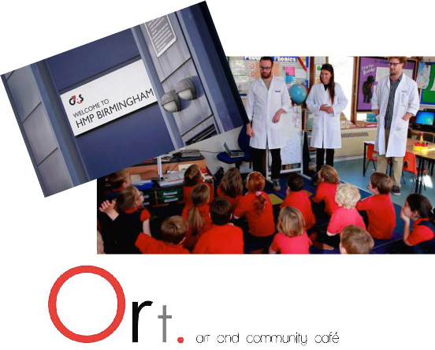
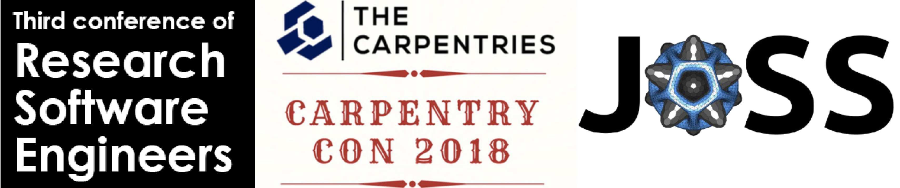
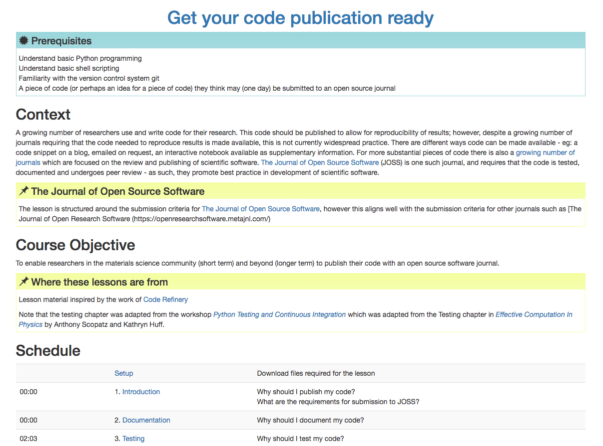

### SSI Fellowship Application 2019

 
Lucy Whalley | PhD student  
Imperial College London  
 
[lucydot.github.io/slides](https://lucydot.github.io/slides)
 
 

<!--s-->

<!--v-->

#### researcher 

 
 
Objective: to optimise and design new materials for energy generation and storage

<!--v-->

#### software..

**USER**  

- code optimised for high performance computing,  eg: [vasp_gpu](https://www.vasp.at/)

**DEVELOPER**  

- post-processing software, eg: [effmass](https://github.com/lucydot/effmass)
- Python (NumPy, SciPy, Pandas, pytest), bash, Julia
- I try to work openly: [lucydot.github.io/open](https://lucydot.github.io/open)

<!--v-->

#### teacher

<!--s-->

<!--v-->

#### I learn

- Conferences in 2018: RSE, CarpentryCon, MozFest
- The Journal of Open Source Software: author and reviewer

<!--v-->

#### I facilitate

- I teach programming skills: git, bash, Python
- I develop teaching materials: [Pandas mini workshop](https://github.com/lucydot/feed-your-python)
- I organise workshops: Python workshop for PhD students

<!--v-->

#### I advocate

"Publishing your Software Project with the Journal of Open Source Software"

<!--s-->

<!--v-->

#### I'd like to...

- Attend RSE conference and CarpentryConnect (poster/talk)
- Software Carpentry on the Orkney Islands?!

<!--v-->

I have an idea!
<!--v-->

#### The Challenge

- researchers can be reluctant to share their code
- undocumented, untested --> "single-use software"

<!--v-->

 
#### The Solution?

<!--v-->

#### Who will I work with?

- Audience: Materials Science initially, if successful --> other domains
- Collaborators: [The Code Refinery](https://coderefinery.org/), Jeremy Cohen (RSE Fellow 2018 / RSLondon), Adam Jackson (SSI Fellow 2018), Anna Krystalli (ROpenSci) + other SSI Fellows?

<!--s-->

#### Thank-you!

Presentation slides + more details: [lucydot.github.io/slides](https://lucydot.github.io/slides/)

