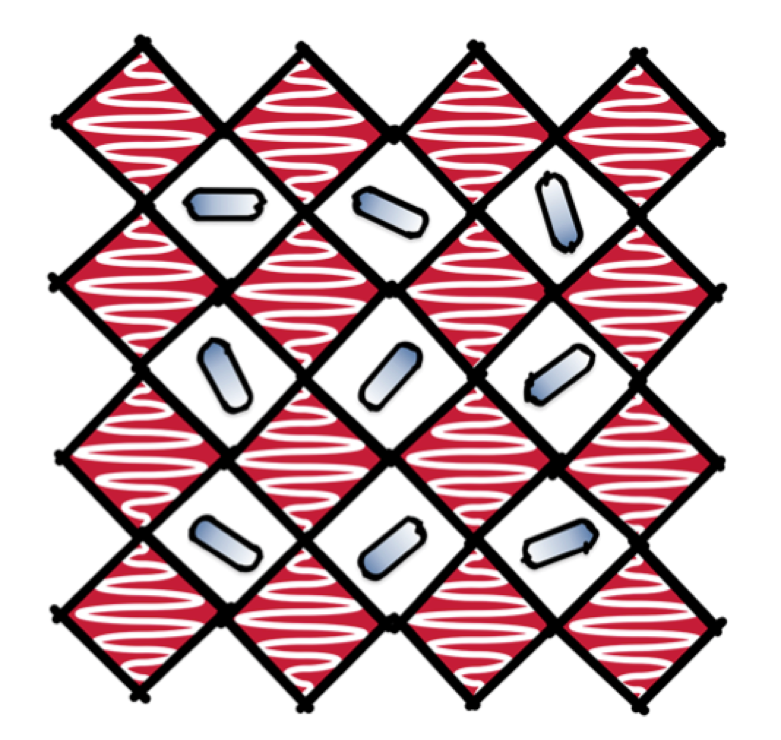
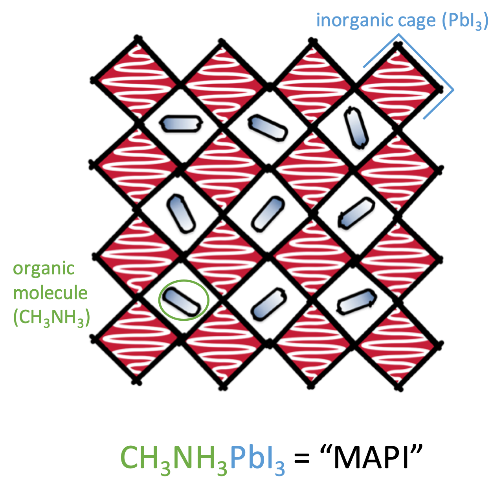
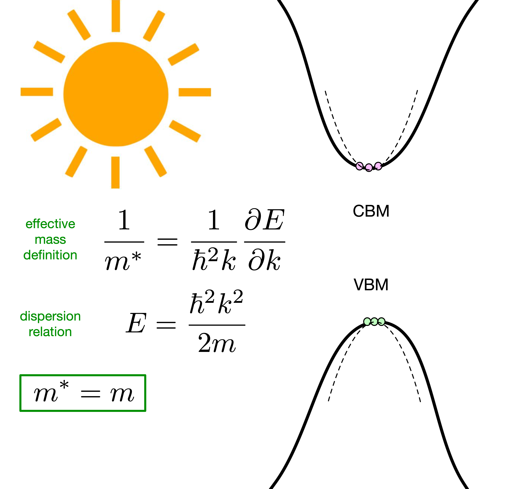
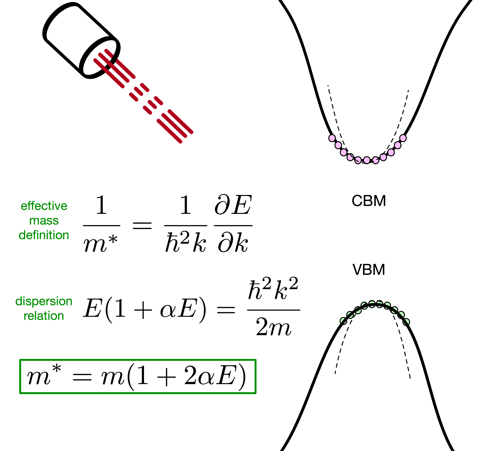
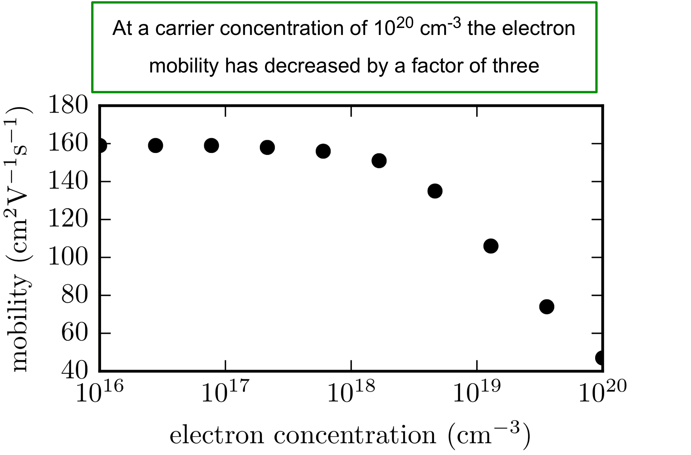

<!-- .slide: data-background="./images/background.png" -->

### Distortions and Defects in Hybrid Halide Perovskites

Lucy Whalley | PhD student  
Materials Design Group | ICL
 
[lucydot.github.io/slides](https://lucydot.github.io/slides)
 
 

<!--s-->

<!-- .slide: data-background="./images/background_tl.png" -->

#### Materials Design Group

 
 
Objective: to optimise and design new materials for energy generation and storage

<!--s-->

<!-- .slide: data-background="./images/background_tl.png" -->

#### Photovoltaic materials

<small>
Efficiency data from *Solar cell efficiency tables (Version 53)*   
M. A. Green et al. | Prog Photovoltaics (2018) | [doi:10.1002/pip.3102](https://onlinelibrary.wiley.com/doi/abs/10.1002/pip.3102)
</small>

<!--s-->

<!-- .slide: data-background="./images/background_tl.png" -->

#### Hybrid halide perovskites 

 

<!--s-->

<!-- .slide: data-background="./images/background_tl.png" -->

#### Hybrid halide perovskites 

<video autoplay="true" loop="true" muted="true" width="800" align="center">
    <source src="./images/MAPI_animation.mp4" type="video/mp4" />
</video>

<small>
*Perspective: Theory and simulation of hybrid halide perovskites*  
L.D. Whalley et al. | J. Chem. Phys (2017) | [doi:10.1063/1.4984964](https://aip.scitation.org/doi/10.1063/1.4984964)
</small>

<!--s-->

<!-- .slide: data-background="./images/background_tl.png" -->

#### Outline

1. Non-parabolic effective mass   
(Electronic band **Distortion**)
2. Band gap broadening  
(Anharmonic lattice **Distortion**)
3. Carrier trapping  
(H-centre **Defects**)

<!--s-->

<!-- .slide: data-background="./images/background_tl.png" -->

#### Non-degenerate semiconductor

<!--s-->

<!-- .slide: data-background="./images/background_tl.png" -->

#### Degenerate semiconductor

<!--s-->

<!-- .slide: data-background="./images/background_tl.png" -->

#### The alpha parameter ($eV^{-1}$)
<small>

| Material       | band         | [100] | [110]| [111]
| ------------- |-------------| -----|-----|-----|
| MAPI      | hole | 4.27 | 1.88| 1.32|
|      | electron      |  2.21 | 1.35| 0.16|
| CdTe | hole      |    1.25| 1.49| 1.64|
|  | electron     |    0.72 | 0.94| 1.02 |

*effmass: An effective mass package*   
L. D. Whalley | JOSS (2018) | [doi:10.21105/joss.00797](https://doi.org/10.21105/joss.00797)
</small>

<!--s-->

<!-- .slide: data-background="./images/background_tl.png" -->

#### The optical effective mass
<small>
>At a carrier concentration of $10^{20}\,\textrm{cm}^{-3}$ the optical effective mass has increased by a factor of two

*Impact of non-parabolic electronic band structure on the properties of PV materials*   
L. D. Whalley et al. | In Review | [arXiv:1811.02281v2](https://arxiv.org/pdf/1811.02281.pdf)

</small>
<!--s-->

<!-- .slide: data-background="./images/background_tl.png" -->

#### Electron mobility
<small>
>At a carrier concentration of $10^{20}\,\textrm{cm}^{-3}$ the electron mobility has decreased by a factor of three

Polaron mobility code available at [github.com/jarvist/PolaronMobility.jl](https://github.com/jarvist/PolaronMobility.jl)

</small>

<!--s-->

<!-- .slide: data-background="./images/background_tl.png" -->

#### Outline

1. Non-parabolic effective mass   
(Electronic band **Distortion**)
2. Band gap broadening  
(Anharmonic lattice **Distortion**)
3. Carrier trapping  
(H-centre **Defects**)

<!--s-->

<!-- .slide: data-background="./images/background_tl.png" -->

#### Lattice anharmonicity

<video autoplay="true" loop="true" muted="true" width="800" align="center">
    <source src="./images/tilting_animation.mp4" type="video/mp4" />
</video>

<!--s-->
<!-- .slide: data-background="./images/background_tl.png" -->

#### Lattice anharmonicity

<small>
Mode-mapping code available at [github.com/JMSkelton/ModeMap](https://github.com/JMSkelton/ModeMap)
</small>

<!--s-->
<!-- .slide: data-background="./images/background_tl.png" -->

#### Band gap broadening
<small>	
> Soft anharmonic octahedral tilting modes increase the band gap of CH$_3$NH$_3$PbI$_3$ 

*Phonon anharmonicity, lifetimes, and thermal transport in CH$_3$NH$_3$PbI$_3$ from many-body perturbation theory*  
L. D. Whalley et al. | Phys. Rev. B (2017) | [doi:10.1103/PhysRevB.94.220301](https://doi.org/10.1103/PhysRevB.94.220301)

</small>

<!--s-->

<!-- .slide: data-background="./images/background_tl.png" -->

#### Outline

1. Non-parabolic effective mass   
(Electronic band **Distortion**)
2. Band gap broadening  
(Anharmonic lattice **Distortion**)
3. Carrier trapping  
(H-centre **Defects**)

<!--s-->
<!-- .slide: data-background="./images/background_tl.png" -->

#### Killer defects
<small>

> "..among native point defects..only the iodine vacancy and its complexes
induce deep electron and hole trapping"  

M. -H. Du | Phys. Chem. Lett. (2015) | [DOI:10.1021/acs.jpclett.5b00199](https://doi.org/10.1021/acs.jpclett.5b00199)

</small>

<!--s-->

#### H-centres in MAPI
<!-- .slide: data-background="./images/background_tl.png" -->

<small>

*H-Center and V-Center Defects in Hybrid Halide Perovskites*    
L. D. Whalley et al. | ACS Energy Lett. (2017) | [doi:10.1021/acsenergylett.7b00995](https://doi.org/10.1021/acsenergylett.7b00995)

</small>

<!--s-->

### Summary
<!-- .slide: data-background="./images/background_tl.png" -->

<!--s-->

#### Thanks
<!-- .slide: data-background="./images/background_tl.png" -->

Presentation slides: [lucydot.github.io/slides](https://lucydot.github.io/slides/)

<!--s-->
<!-- .slide: data-background="./images/background_tl.png" -->

#### Questions?

Calculation details:

<!--s-->

### Extra slides

- hot carrier cooling work
- vibrational defect work

