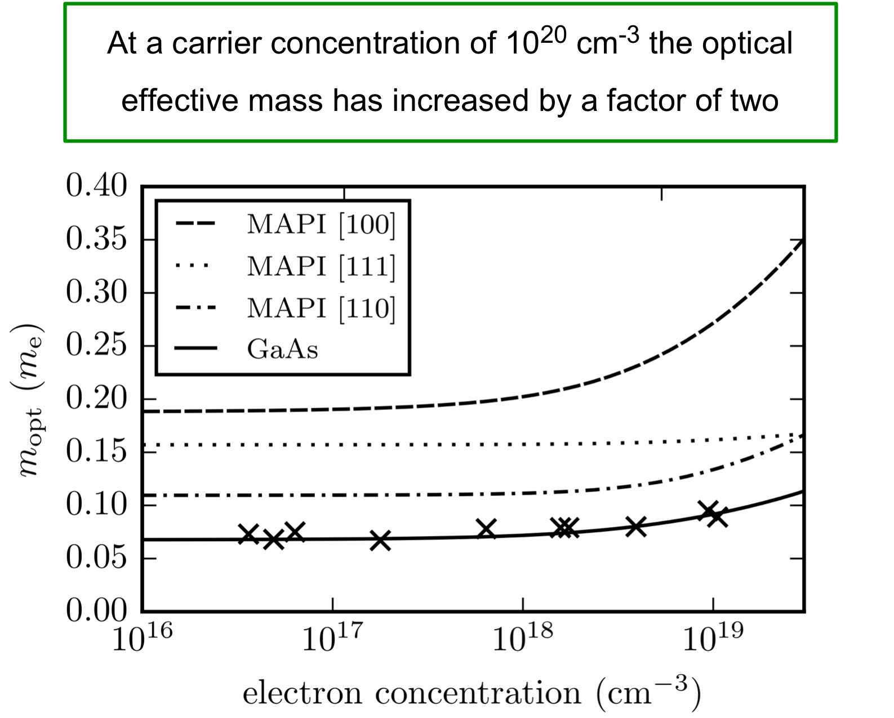
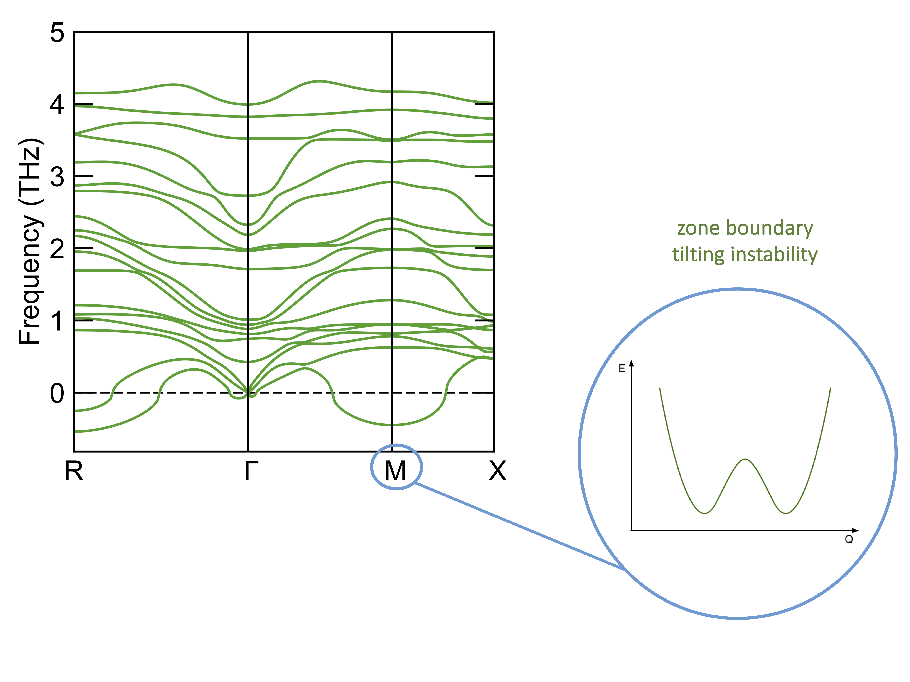
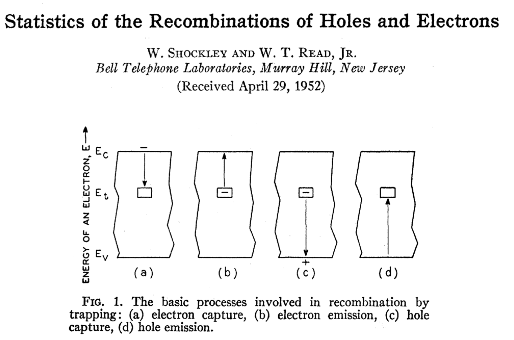

<!-- .slide: data-background="./images/background.png" -->

### Distortions and Defects in Hybrid Halide Perovskites

Lucy Whalley | PhD student  
Materials Design Group | ICL
 
[lucydot.github.io/slides](https://lucydot.github.io/slides)
 
 

<!--s-->

<!-- .slide: data-background="./images/background_tl.png" -->

#### Materials Design Group

 
 
Objective: to optimise and design new materials for energy generation and storage

<!--s-->

<!-- .slide: data-background="./images/background_tl.png" -->

#### Photovoltaic materials

<!--s-->

<!-- .slide: data-background="./images/background_tl.png" -->

#### Hybrid halide perovskites 

<video autoplay="true" loop="true" muted="true" width="800" align="center">
    <source src="./images/MAPI_animation.mp4" type="video/mp4" />
</video>

<small>
"Perspective: Theory and simulation of hybrid halide perovskites"  
`doi:10.1063/1.4984964`
</small>

<!--s-->

<!-- .slide: data-background="./images/background_tl.png" -->

#### Non-degenerate semiconductor

<!--s-->

<!-- .slide: data-background="./images/background_tl.png" -->

#### Degenerate semiconductor

<!--s-->

<!-- .slide: data-background="./images/background_tl.png" -->

#### The alpha parameter ($eV^{-1}$)

 

| Material       | band         | [100] | [110]| [111]
| ------------- |-------------| -----|-----|-----|
| MAPI      | hole | 4.27 | 1.88| 1.32|
|      | electron      |  2.21 | 1.35| 0.16|
| CdTe | hole      |    1.25| 1.49| 1.64|
|  | electron     |    0.72 | 0.94| 1.02 |

MAPI has non-parabolic and anisotropic electronic dispersion
<!--s-->

<!-- .slide: data-background="./images/background_tl.png" -->

#### The optical effective mass

Optical effective mass increases by factor
<!--s-->

<!-- .slide: data-background="./images/background_tl.png" -->

#### Electron mobility

Electron mobility decreases by 
<!--s-->

<!-- .slide: data-background="./images/background_tl.png" -->

#### Lattice anharmonicity

<video autoplay="true" loop="true" muted="true" width="800" align="center">
    <source src="./images/tilting_animation.mp4" type="video/mp4" />
</video>

<small>
"Perspective: Theory and simulation of hybrid halide perovskites"  
`doi:10.1063/1.4984964`
</small>

<!--s-->
<!-- .slide: data-background="./images/background_tl.png" -->

#### Lattice anharmonicity

<!--s-->
<!-- .slide: data-background="./images/background_tl.png" -->

#### Band gap broadening

Soft anharmonic octahedral tilting modes increase the band gap of CH3NH3PbI3

<!--s-->
<!-- .slide: data-background="./images/background_tl.png" -->

#### Killer defects

<!--s-->

#### H-centres in MAPI
<!-- .slide: data-background="./images/background_tl.png" -->

<!--s-->

### Summary
<!-- .slide: data-background="./images/background_tl.png" -->

<!--s-->

#### Thanks
<!-- .slide: data-background="./images/background_tl.png" -->

Presentation slides: [lucydot.github.io/slides](https://lucydot.github.io/slides/)

<!--s-->
<!-- .slide: data-background="./images/background_tl.png" -->

#### Questions?

Calculation details:

<!--s-->

### Extra slides

- hot carrier cooling work
- vibrational defect work

